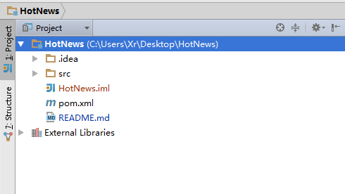
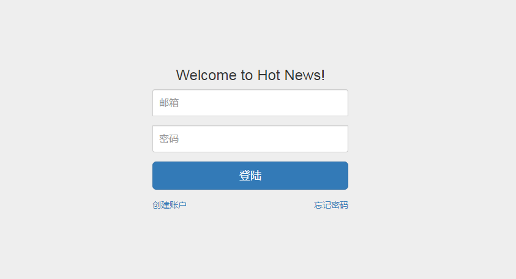
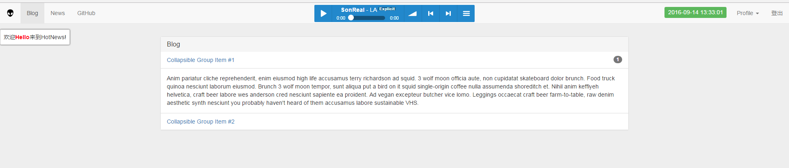

# HotNews
## HotNews是什么?
HotNews是作者个人根据Java Web框架构建的一套web登陆系统,该系统支持blog展现,撰写,评论,点赞,在线音乐播放,热门新闻查看等功能.同时也支持个人开发功能插件. 
<b>Notes:该系统某些功能正在完善中!</b>
## 使用及开发
* 环境搭建
    * 导入项目
        * 打开<b>IntelliJ IDEA</b>;
        * 选择Import Project;
        * 选择Project所在目录;
        * Import Project-> Import Project from external model -> Maven;
        * 选择下一步(next),直到项目导入到IntelliJ IDEA中;
        *  
        Notes: 该项目基于tomcat7及以上版本运行及基于IntelliJ IDEA IDE开发;
* 使用教程
    * <b>使用前的操作</b>
        * 配置mysql
            - src/main/java/com/springapp/mvc/resources/<b>mysql.properties</b>
                + <b>db.url</b>: (e.g: <b style='color: blue;'>jdbc:mysql://localhost:3306/test</b>)
                + <b>db.username</b>: your database username
                + <b>db.password</b>: your database password
        * 初始化数据库
            - 执行src/main/java/com/springapp/mvc/resources目录下的<b>init.sql</b>脚本;
        * 配置邮箱
            - src/main/java/com/springapp/mvc/resources/mail.properties
                + <b>host</b>: mail@host.com
                + <b>username</b>: your email address
                + <b>password</b>: your password
    * 当环境搭建完成后,则会看到以下页面.
    * 
    * 注册登陆
        * 登陆后的主页面
        * 

## FAQ
* 登陆不了系统
    * 是否初始化了数据库;
    * 是否配置了mysql;
    * 是否注册并正确填写注册信息;
    * <b>重要(important)</b>:
        -   如果是在开发中登陆不了,以上3个条件都正确,可能的原因是: 
            +   在IntelliJ IDEA中可能找不到对应的配置文件,但是配置文件又存在,这时就
            需要在<b>IntelliJ IDEA</b>中设置src/main/java/com/springapp/mvc/resources目录为资源目录.
* 忘记密码功能(基于开发)
    * 忘记密码功能基于mail.properties文件中配置信息发送密码修改邮件到注册时的邮箱账户,如未收到邮件,请检查mail.properties是否填写正确.

## 问题反馈
Email:<a href='mailto:Xiaorui0629@gmail.com'>Xiaorui0629@gmail.com</a>

## 关于作者
NickName: Rui Shawn 
Email: <a href='mailto:Xiaorui0629@gmail.com'>Xiaorui0629@gmail.com</a> 
WebSite: <a href='www.ruixiao.org'>www.ruixiao.org</a> 

## License
See <a href="LICENSE.txt">License</a>

